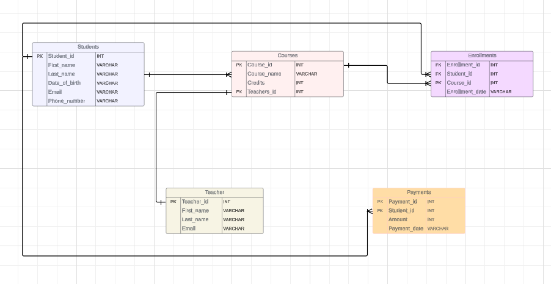

# Task 1. Database Design:


## 1. Create the database named "SISDB"

 ```sql     
          create database SISDB;
           use SISDB;   
```      

## 2. Define the schema for the Students, Courses, Enrollments, Teacher, and Payments tables based on the provided schema.Write SQL scripts to create the mentioned tables with appropriate data types, constraints, and relationships. 


### Creating the Students table
```sql
CREATE TABLE Students (
    student_id INT PRIMARY KEY,
    first_name VARCHAR(50),   
    last_name VARCHAR(50),
    date_of_birth VARCHAR(20),
    email VARCHAR(100),
    phone_number VARCHAR(20)
);
```
### Creating the Teacher table
```sql
CREATE TABLE Teacher (
    teacher_id INT PRIMARY KEY,
    first_name VARCHAR(50),
    last_name VARCHAR(50),
    email VARCHAR(100)
);
```
### Creating the Courses table
```sql
CREATE TABLE Courses (
    course_id INT PRIMARY KEY,
    course_name VARCHAR(100),
    credits INT,
    teacher_id INT,
    FOREIGN KEY (teacher_id) REFERENCES Teacher(teacher_id)
);
```
### Creating the Enrollments table
```sql
CREATE TABLE Enrollments (
    enrollment_id INT PRIMARY KEY,
    student_id INT,
    course_id INT,
    enrollment_date VARCHAR(50),
    FOREIGN KEY (student_id) REFERENCES Students(student_id),
    FOREIGN KEY (course_id) REFERENCES Courses(course_id)
);
```
### Creating the Payments table
```sql
CREATE TABLE Payments (
    payment_id INT PRIMARY KEY,
    student_id INT,
    amount INT,
    payment_date VARCHAR (50),
    FOREIGN KEY (student_id) REFERENCES Students(student_id)
);
```

## 3. Create an ERD (Entity Relationship Diagram) for the database
   


 ## 4. Create appropriate Primary Key and Foreign Key constraints for referential integrity


## 5. Insert at least 10 sample records into each of the following tables.

### 1. STUDENTS
```sql
INSERT INTO Students (student_id, first_name, last_name, date_of_birth, email, phone_number)
VALUES
(1, 'Arjun', 'Reddy', '1999-10-10', 'arjun.reddy@example.com', '9234567890'),
(2, 'Jane', 'Smith', '2000-03-15', 'jane.smith@example.com', '1876754678'),
(3, 'Michael', 'Johnson', '2002-10-19', 'michael.johnson@example.com', '9567653215'),
(4, 'Emily', 'Brown', '1995-01-01', 'emily.brown@example.com', '9670987652'),
(5, 'David', 'Jones', '1998-05-25', 'david.jones@example.com', '2123098763'),
(6, 'Manju', 'Shilma', '2000-10-11', 'manjus.hilma@example.com', '9234557890'),
(7, 'Swetha', 'Naidu', '1999-03-23', 'swetha.naidu@example.com', '9786754867'),
(8, 'Abin', 'Surya', '2000-10-10', 'abin.surya@example.com', '8756653251'),
(9, 'Sandhiya', 'Bheema', '2001-03-12', 'sandhiya.bheema@example.com', '9076987625'),
(10, 'Dakil', 'Jones', '1998-09-29', 'dakil.jones@example.com', '9321098736');
```


### 2.TEACHER
```sql
INSERT INTO Teacher (teacher_id, first_name, last_name, email)
VALUES
(1, 'Revathi', 'John', 'revathi.john@example.com'),
(2, 'Boby', 'Smith', 'boby.smith@example.com'),
(3, 'Manasa', 'Shetty', 'manasa.shetty@example.com'),
(4, 'Joe', 'Smith', 'joe.smith@example.com'),
(5, 'Lily', 'Mary', 'lily.mary@example.com'),
(6, 'Kayal', 'Shree', 'kayal.shree@example.com'),
(7, 'Roshini', 'Veera', 'roshini.veera@example.com'),
(8, 'Robert', 'Johny', 'robert.johny@example.com'),
(9, 'Surya', 'Kumar', 'surya.kumar@example.com'),
(10, 'Mahendra', 'singh', 'mahendra.singh@example.com');
```
### 3.COURSES
```sql
INSERT INTO Courses (course_id, course_name, credits, teacher_id)
VALUES
(1, 'CSE', 3, 1),
(2, 'EEE', 4, 2),
(3, 'ECE', 3, 10),
(4, 'IT', 2, 7),
(5, 'BCA', 1, 7),
(6, 'BBA', 2, 8),
(7, 'BSC', 3, 9),
(8, 'MSC', 3, 6),
(9, 'BA', 4, 3),
(10, 'MCA', 3, 2);
```
### 4.ENROLLMENTS
```sql
INSERT INTO Enrollments (enrollment_id, student_id, course_id, enrollment_date)
VALUES
(1, 1, 8, '2022-10-19'),
(2, 2, 1, '2023-02-20'),
(3, 3, 4, '2023-03-18'),
(4, 9, 8, '2023-01-01'),
(5, 2, 5, '2022-04-02'),
(6, 7, 1, '2022-09-14'),
(7, 5, 1, '2023-05-15'),
(8, 10, 10, '2022-06-14'),
(9, 1, 4, '2023-07-13'),
(10, 8, 6, '2022-10-19');
```


### 5.PAYMENTS
```sql
INSERT INTO Payments (payment_id, student_id, amount, payment_date)
VALUES
(1, 1, 10000, '2023-2-22'),
(2, 2, 15000, '2023-3-20'),
(3, 1, 20000, '2023-1-10'),
(4, 4, 9000, '2023-4-4'),
(5, 5, 15000, '2022-4-4'),
(6, 4, 30000, '2021-10-15'),
(7, 7, 10000, '2023-5-25'),
(8, 4, 18000, '2022-8-20'),
(9, 9, 21000, '2023-9-29'),
(10, 10, 31000, '2022-10-30');
```


# Tasks 2: Select, Where, Between, AND, LIKE: 

## 1. Write an SQL query to insert a new student into the "Students" table with the following details:
a. First Name: John
b. Last Name: Doe
				c. Date of Birth: 1995-08-15
									d. Email: john.doe@example.com
										e. Phone Number: 1234567890
 ```sql                                       
 insert into Students values(11,'John','Doe','1995-08-15','john.doe@example.com','1234567890');
```
 ## 2. Write an SQL query to enroll a student in a course. Choose an existing student and course and insert a record into the "Enrollments" table with the enrollment date.Choose an existing student_id and course_id, and specify the enrollment_date
 ```sql
  insert into Enrollments values(11,1, 3, '2023-04-27');
```

## 3. Update the email address of a specific teacher in the "Teacher" table. Choose any teacher and modify their email address.
```sql 
update Teacher set email='surya.kumar11@example.com' where first_name='Surya' and last_name='Kumar';
```	
	
## 4. Write an SQL query to delete a specific enrollment record from the "Enrollments" table. Select an enrollment record based on the student and course.
```sql
 delete from enrollments where student_id=8 and course_id=6;
 ```

 ## 5. Update the "Courses" table to assign a specific teacher to a course. Choose any course and teacher from the respective tables.
 ```sql
 update courses set course_name='BCOM' where teacher_id=1
 ```
 ## 6. Delete a specific student from the "Students" table and remove all their enrollment records from the "Enrollments" table. Be sure to maintain referential integrity.
```sql
 delete from payments where student_id=2;
 delete from Enrollments where student_id=2;
 delete from Students where student_id=2;
```
 ## 7. Update the payment amount for a specific payment record in the "Payments" table. Choose any payment record and modify the payment amount.
 ```sql
 update Payments set amount=11000 where payment_id=1;
```


 # Task 3. Aggregate functions, Having, Order By, GroupBy and Joins:


## 1. Write an SQL query to calculate the total payments made by a specific student. You will need to join the "Payments" table with the "Students" table based on the student's ID.
```sql    
select sum(amount) as Total_Payment,p.student_id from Payments p inner join Students s on p.student_id=s.student_id group by p.student_id having p.student_id=4;
```
## 2. Write an SQL query to retrieve a list of courses along with the count of students enrolled in each course.Use a JOIN operation between the "Courses" table and the "Enrollments" table.
```sql
 select count(student_id) as students_enrolled,c.course_name from Courses c inner join Enrollments e on c.course_id=e.course_id group by course_name
```
 ## 3. Write an SQL query to find the names of students who have not enrolled in any course. Use a LEFT JOIN between the "Students" table and the "Enrollments" table to identify students without enrollments.
```sql
  select distinct s.first_name,s.last_name from  Students s left join  Enrollments e on s.student_id = e.student_id where e.student_id IS NULL;
```
## 4. Write an SQL query to retrieve the first name, last name of students, and the names of the courses they are enrolled in. Use JOIN operations between the "Students" table and the "Enrollments" and "Courses" tables.
 ```sql
  select s.first_name,s.last_name,c.course_name from Students s inner join Enrollments e on s.student_id = e.student_id inner join
  Courses c on e.course_id = c.course_id;
```
## 5. Create a query to list the names of teachers and the courses they are assigned to. Join the "Teacher" table with the "Courses" table.
```sql
  select first_name,last_name,course_name from teacher t inner join courses c on t.teacher_id=c.teacher_id;
```
## 6. Retrieve a list of students and their enrollment dates for a specific course. You'll need to join the "Students" table with the "Enrollments" and "Courses" tables.
```sql
  select S.first_name,S.last_name,e.enrollment_date from Students s inner join Enrollments e on s.student_id= e.student_id
  inner join Courses c on e.course_id=c.course_id where c.course_name='IT';
```
## 7. Find the names of students who have not made any payments. Use a LEFT JOIN between the "Students" table and the "Payments" table and filter for students with NULL payment records.
```sql
  select first_name,last_name from Students s left join Payments p on s.student_id=p.student_id where p.amount is null;
```
## 8. Write a query to identify courses that have no enrollments. You'll need to use a LEFT JOIN between the "Courses" table and the "Enrollments" table and filter for courses with NULL enrollment records.
```sql
  select course_name from courses  c left join Enrollments e  on  c.course_id=e.course_id where e.enrollment_id is null;
```
## 9. Identify students who are enrolled in more than one course. Use a self-join on the "Enrollments" table to find students with multiple enrollment records.
```sql
   select count(course_id),student_id from Enrollments group by student_id having count(course_id)>1
   --or
  select a.student_id from Enrollments a join Enrollments b on a.student_id=b.student_id group by a.student_id having count(a.enrollment_id)>1
```
## 10. Find teachers who are not assigned to any courses. Use a LEFT JOIN between the "Teacher" table and the "Courses" table and filter for teachers with NULL course assignments.
```sql
select  t.teacher_id, t.first_name, t.last_name from Teacher t left join  Courses c on t.teacher_id = c.teacher_id where  c.teacher_id is null;
```


# Task 4. Subquery and its type:


## 1. Write an SQL query to calculate the average number of students enrolled in each course. Use aggregate functions and subqueries to achieve this.
```sql
select course_id,avg(num_students) as average from  (select course_id,count(*) as num_students from 
  Enrollments group by  course_id ) as student_counts group by course_id; 
 ``` 
## 2. Identify the student(s) who made the highest payment. Use a subquery to find the maximum payment amount and then retrieve the student(s) associated with that amount.
```sql
 select student_id,first_name ,last_name from students where student_id in( select student_id from Payments where amount in (select max(amount) from Payments)  )
```

## 3. Retrieve a list of courses with the highest number of enrollments. Use subqueries to find the course(s) with the maximum enrollment count.
```sql                         
select c.course_id, c.course_name, count(*) as enrollment_count from Courses c join Enrollments e on c.course_id =e.course_id group by c.course_id, c.course_name having count(*) = (select max(enrollment_count) from (select count(*)
as enrollment_count from Enrollments group by course_id) as max_enrollment)
```						  
## 4. Calculate the total payments made to courses taught by each teacher. Use subqueries to sum payments for each teacher's courses	
```sql               
select teacher_id, first_name, last_name, (select sum(amount) from Payments where student_id IN (select student_id from 
		Enrollments where course_id IN (select course_id from Courses where teacher_id = t.teacher_id))) as total_payments from Teacher t;
```
## 5. Identify students who are enrolled in all available courses. Use subqueries to compare a student's enrollments with the total number of courses.

```sql
  SELECT student_id,first_name,last_name FROM  Students WHERE (SELECT COUNT(DISTINCT course_id) FROM Courses) = (SELECT COUNT(DISTINCT course_id)
  FROM Enrollments WHERE Enrollments.student_id = Students.student_id);
```
## 6. Retrieve the names of teachers who have not been assigned to any courses. Use subqueries to find teachers with no course assignments.
```sql
 select first_name,last_name from teacher where teacher_id not in(select teacher_id from Courses)
```
## 7. Calculate the average age of all students. Use subqueries to calculate the age of each student based on their date of birth.

```sql 
select avg(age) as average_age from (select 2024 - cast(substring(date_of_birth, 1, 4) as int) as age from Students) as student_age;
```
	   
## 8. Identify courses with no enrollments. Use subqueries to find courses without enrollment records.
```sql
  select course_name from Courses where course_id not in (select course_id from Enrollments)
```
 ## 9. Calculate the total payments made by each student for each course they are enrolled in. Use subqueries and aggregate functions to sum payments.
```sql
select student_id,  course_id, ( select sum(amount) from Payments where Payments.student_id = Enrollments.student_id ) as total_payments from Enrollments;
```
## 10. Identify students who have made more than one payment. Use subqueries and aggregate functions to count payments per student and filter for those with counts greater than one.
  
  ```sql
  select first_name,last_name,student_id from Students where student_id in ( select student_id from payments group by student_id having count(payment_id)>1 ) 
 ```

## 11. Write an SQL query to calculate the total payments made by each student. Join the "Students" table with the "Payments"table and use GROUP BY to calculate the sum of payments for each student.
 ```sql 
  select s.first_name,s.last_name,sum(p.amount) from Students s  join Payments p on  s.student_id=p.student_id  group by s.student_id,s.first_name,s.last_name
 ``` 
## 12. Retrieve a list of course names along with the count of students enrolled in each course. Use JOIN operations between the "Courses" table and the "Enrollments" table and GROUP BY to count enrollments.
```sql
select course_name,count(e.course_id) as total_count from Courses c inner join Enrollments e on c.course_id=e.course_id group by c.course_id,c.course_name
```
## 13. Calculate the average payment amount made by students. Use JOIN operations between the "Students" table and the "Payments" table and GROUP BY to calculate the average.
```sql
 select first_name,last_name,avg(p.amount) from Students s inner join Payments p on s.student_id=p.student_id group by s.student_id,s.first_name,s.last_name
```